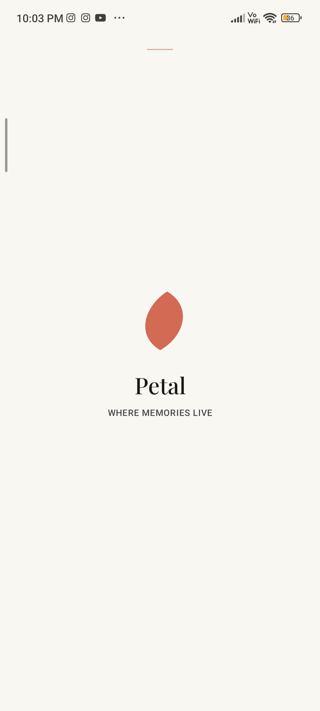
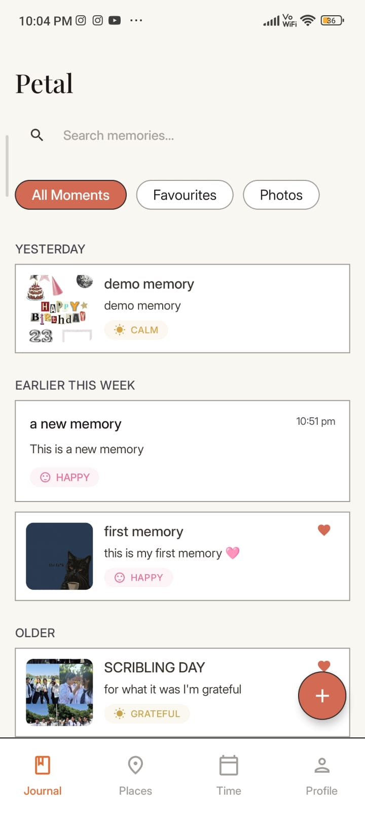
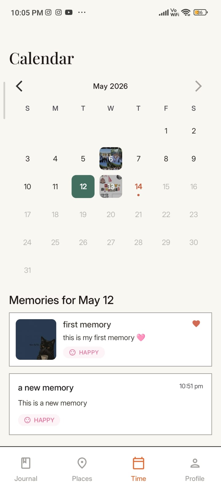
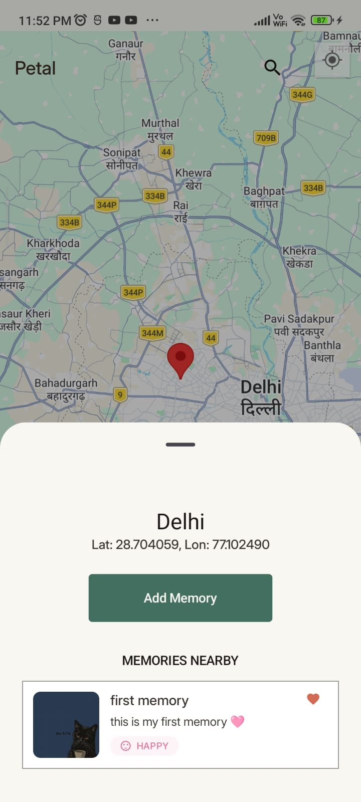
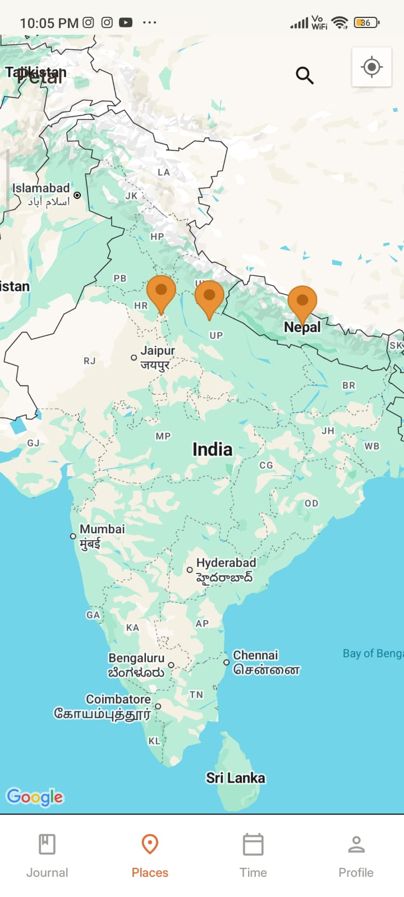
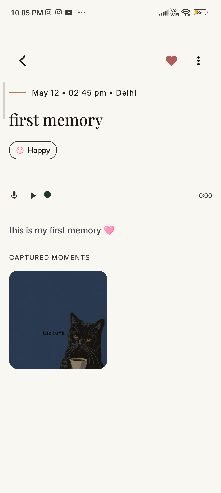
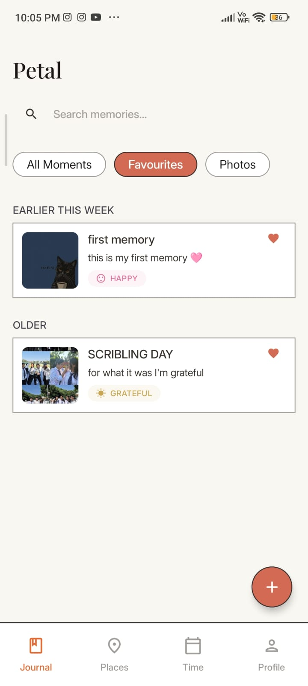
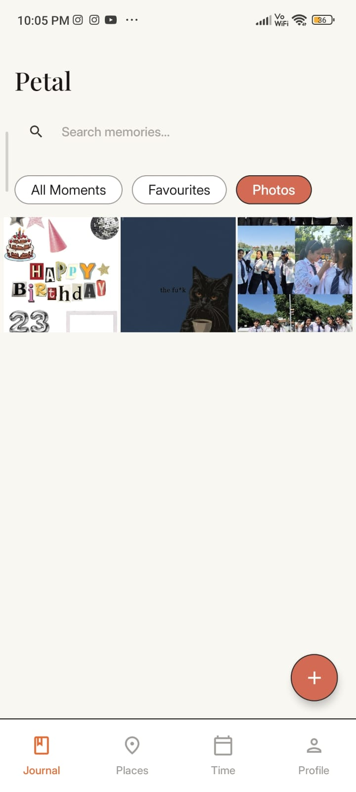
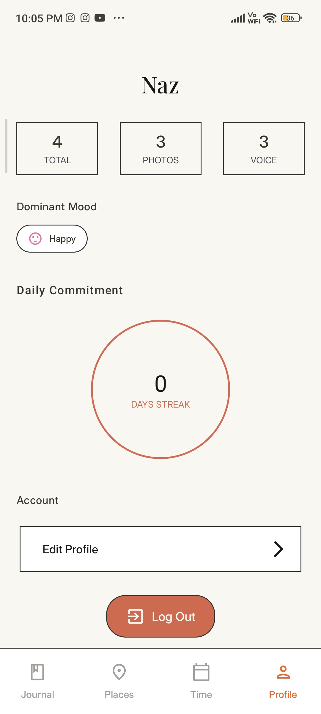
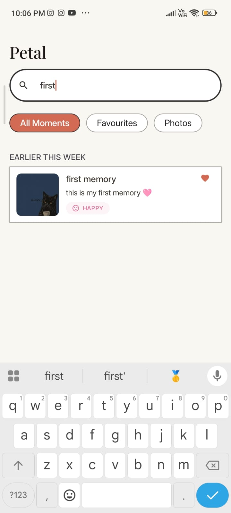

# Petal 🌸

[](https://github.com/Moubina-naz/petal/releases/latest)

**Petal** is a full-stack memory journaling application designed to help users capture, organize, and revisit meaningful life moments.
It combines a modern Android client built with Jetpack Compose and a scalable backend powered by Django REST Framework.

Unlike basic journaling apps, Petal transforms memories into rich, multi-dimensional entries by integrating **location, mood, images, and audio** into a single experience.

---

## 📸 Screenshots

<div align="center">
  <table style="border: none; border-collapse: collapse;">
    <tr>
      <td align="center"><b>Splash Screen</b></td>
      <td align="center"><b>Home Screen</b></td>
      <td align="center"><b>Calendar</b></td>
    </tr>
    <tr>
      <td></td>
      <td></td>
      <td></td>
    </tr>
    <tr>
      <td align="center"><b>Map Pin</b></td>
      <td align="center"><b>Map View</b></td>
      <td align="center"><b>Memory Detail</b></td>
    </tr>
    <tr>
      <td></td>
      <td></td>
      <td></td>
    </tr>
    <tr>
      <td align="center"><b>Favourites</b></td>
      <td align="center"><b>Image Gallery</b></td>
      <td align="center"><b>Profile</b></td>
    </tr>
    <tr>
      <td></td>
      <td></td>
      <td></td>
    </tr>
    <tr>
      <td align="center" colspan="3"><b>Search</b></td>
    </tr>
    <tr>
      <td align="center" colspan="3"></td>
    </tr>
  </table>
</div>


## ✨ Features

* **Mood Tracking**
  Capture emotional context (Happy, Calm, Sad, Anxious, etc.)

* **Location Tagging**
  Add precise locations using Google Maps & Places API

* **Rich Media Support**

  * Upload multiple images
  * Record or attach audio notes

* **Cloud-Based Storage**
  Media storage and delivery powered by Cloudinary

* **Memory Organization**

  * Tagging system
  * Favorites marking
  * Monthly filtering

* **Secure Authentication**
  JWT-based authentication for protected API access

---

## 🧠 Architecture

### Frontend (Android)

* **Architecture**: MVVM
* **State Management**: ViewModel + Kotlin Flow
* **UI**: Jetpack Compose (Material 3)
* **Networking**: Retrofit + Gson
* **Image Loading**: Coil
* **Navigation**: Voyager
* **Concurrency**: Kotlin Coroutines
* **Location Services**: Google Maps SDK, Places API

### Backend (API Server)

* **Framework**: Django + Django REST Framework
* **Database**: PostgreSQL
* **Authentication**: JWT (Simple JWT)
* **Media Storage**: Cloudinary
* **Media Processing**:

  * Pillow (images)
  * Mutagen (audio metadata validation)

---

## 🔄 Data Flow

1. User creates a memory in the Android app
2. ViewModel processes and validates input
3. Repository layer sends data via Retrofit
4. Django API handles validation and persistence
5. Media files are uploaded to Cloudinary
6. Response is returned and UI updates reactively via Flow

---

## ⚡ Key Engineering Challenges

* Efficient handling of **multi-part media uploads (images + audio)**
* Maintaining **reactive UI updates** using Kotlin Flow
* Integrating **location services with graceful fallback handling**
* Implementing **secure JWT-based authentication flow**
* Managing **scalable media storage and delivery**

---

## 🛠 Tech Stack

### Mobile App

* Kotlin
* Jetpack Compose
* Retrofit
* Gson
* Coil
* Coroutines

### Backend

* Django
* Django REST Framework
* PostgreSQL
* Cloudinary

---

## 🚀 Getting Started

### Prerequisites

* Python 3.10+
* Android Studio (latest)
* PostgreSQL
* Cloudinary account
* Google Maps API key

---

### Backend Setup

```bash
cd backend/memory_project
python -m venv venv
```

Activate environment:

```bash
# Windows
venv\Scripts\activate

# macOS/Linux
source venv/bin/activate
```

Install dependencies:

```bash
pip install -r requirements.txt
```

Create `.env` file:

```env
DEBUG=True
SECRET_KEY=your_secret_key

DB_NAME=your_db_name
DB_USER=your_db_user
DB_PASSWORD=your_db_password
DB_HOST=localhost
DB_PORT=5432

CLOUDINARY_URL=cloudinary://<api_key>:<api_secret>@<cloud_name>
```

Run server:

```bash
python manage.py makemigrations
python manage.py migrate
python manage.py runserver
```

---

### Android Setup

1. Open project in Android Studio
2. Add API key in `local.properties`:

```properties
MAPS_API_KEY=your_google_maps_api_key
```

3. Run on emulator or device

---

## 🧾 API Overview

### Authentication

* `POST /register/`
* `POST /login/`

### User

* `GET /profile/`

### Memories

* `GET /memories/`
* `POST /memories/`
* `GET /memories/<id>/`
* `GET /memories/by-month/`

### Actions

* `POST /memories/<id>/favorite/`
* `POST /memories/<id>/images/`
* `POST /memories/<id>/audio/`

> All endpoints require:

```
Authorization: Bearer <token>
```

---

### Example Request

**POST /memories/**

```json
{
  "title": "Beach Day",
  "mood": "Happy",
  "location": "Goa",
  "tags": ["travel", "friends"]
}
```

---

## 🤝 Contributing

1. Fork the repository
2. Create a new branch
3. Commit changes
4. Push and open a Pull Request

---

## 📄 License

This project is licensed under the MIT License.
